---
lab:
    title: '1: Implementing Highly Available Azure IaaS Compute Architecture'
    module: 'Module 1: Implement Load Balancing and Network Security'
---

# Lab: Implementing Highly Available Azure IaaS Compute Architecture
# Student lab manual

## Lab scenario
  
Adatum Corporation has several on-premises workloads running on a mix of physical servers and virtual machines. Most of the workloads require some level of resiliency, including a range of high availability SLAs. Most of the workloads leverage either Windows Server Failover Clustering or Linux Corosync clusters and Pacemaker resource manager, with synchronous replication between cluster nodes. Adatum is trying to determine how the equivalent functionality can be implemented in Azure. In particular, the Adatum Enterprise Architecture team is exploring the Azure platform capabilities that accommodate high availability requirements within the same data center and between data centers in the same region.

In addition, the Adatum Enterprise Architecture team realizes that resiliency alone might not be sufficient to provide the level of availability expected by its business operations. Some of the workloads have highly dynamic usage patterns, which are currently addressed based on continuous monitoring and custom scripting solutions, automatically provisioning and deprovisioning additional cluster nodes. Usage patterns of others are more predictable, but also need to be occasionally adjusted to account for increase demand for disk space, memory, or processing resources.

To accomplish these objectives, the Architecture team wants to test a range of highly available IaaS compute deployments, including:

-  Availability sets-based deployment of Azure VMs behind an Azure Load Balancer Basic

-  Zone-redundant deployment of Azure VMs behind an Azure Load Balancer Standard

-  Zone-redundant deployment of Azure VM scale sets behind an Azure Application Gateway

-  Automatic horizontal scaling of Azure VM scale sets (autoscaling) 

-  Manual vertical scaling (compute and storage) of Azure VM scale sets

An availability set represents a logical grouping of Azure VMs which controls their physical placement within the same Azure datacenter. Azure makes sure that the VMs within the same availability set run across multiple physical servers, compute racks, storage units, and network switches. If a hardware or software failure happens, only a subset of your VMs are impacted and your overall solution stays operational. Availability Sets are essential for building reliable cloud solutions. With availability sets, Azure offers 99.95% VM uptime SLA.

Availability zones represent unique physical locations within a single Azure region. Each zone is made up of one or more datacenters equipped with independent power, cooling, and networking. The physical separation of availability zones within a region protects applications and data from datacenter failures. Zone-redundant services replicate your applications and data across availability zones to protect from single-points-of-failure. With availability zones, Azure offers 99.99% VM uptime SLA.

Azure virtual machine scale sets let you create and manage a group of identical, load balanced VMs. The number of VM instances can automatically increase or decrease in response to demand or a defined schedule. Scale sets provide high availability to your applications, and allow you to centrally manage, configure, and update many VMs. With virtual machine scale sets, you can build large-scale services for areas such as compute, big data, and container workloads.

## Objectives
  
After completing this lab, you will be able to:

-  Describe characteristics of highly available Azure VMs residing in the same availability set behind a Azure Load Balancer Basic

-  Describe characteristics of highly available Azure VMs residing in different availability zones behind an Azure Load Balancer Standard

-  Describe characteristics of automatic horizontal scaling of Azure VM Scale Sets

-  Describe characteristics of manual vertical scaling of Azure VM Scale Sets


## Lab Environment

Estimated Time: 120 minutes


## Lab Files

-  C:\AllFiles\AZ-303-Microsoft-Azure-Architect-Technologies-master\Allfiles\Labs\01azuredeploy30301suba.json

-  C:\AllFiles\AZ-303-Microsoft-Azure-Architect-Technologies-master\Allfiles\Labs\01\azuredeploy30301rga.json

-  C:\AllFiles\AZ-303-Microsoft-Azure-Architect-Technologies-master\Allfiles\Labs\01\azuredeploy30301rga.parameters.json

-  C:\AllFiles\AZ-303-Microsoft-Azure-Architect-Technologies-master\Allfiles\Labs\01\azuredeploy30301rgb.json

-  C:\AllFiles\AZ-303-Microsoft-Azure-Architect-Technologies-master\Allfiles\Labs\01\azuredeploy30301rgb.parameters.json

-  C:\AllFiles\AZ-303-Microsoft-Azure-Architect-Technologies-master\Allfiles\Labs\01\azuredeploy30301rgc.json

-  C:\AllFiles\AZ-303-Microsoft-Azure-Architect-Technologies-master\Allfiles\Labs\01\azuredeploy30301rgc.parameters.json

-  C:\AllFiles\AZ-303-Microsoft-Azure-Architect-Technologies-master\Allfiles\Labs\01\az30301e-configure_VMSS_with_data_disk.ps1


## Instructions

### Exercise 1: Implement and analyze highly available Azure VM deployments using availability sets and Azure Load Balancer Basic
  
The main tasks for this exercise are as follows:

1. Deploy highly available Azure VMs into an availability set behind an Azure Load Balancer Basic by using Azure Resource Manager templates

1. Analyze highly available Azure VMs deployed into an availability set behind an Azure Load Balancer Basic

1. Remove Azure resources deployed in the exercise

#### Task 1: Deploy highly available Azure VMs into an availability set behind an Azure Load Balancer Basic by using Azure Resource Manager templates

1. From your lab computer, start a web browser, navigate to the [Azure portal](https://portal.azure.com), and sign in by providing credentials of a user account with the Owner role in the subscription you will be using in this lab.

1. In the Azure portal, open the **Cloud Shell** pane by selecting on the toolbar icon directly to the right of the search textbox.

    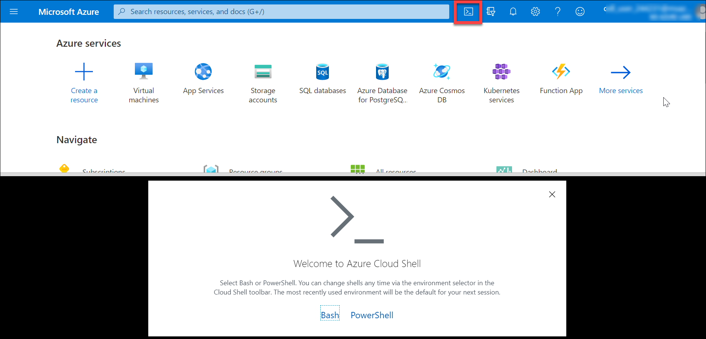
   
1. If prompted to select either **Bash** or **PowerShell**, select **Bash**. 

    >**Note**: 
    
    i. If this is the first time you are starting **Cloud Shell** and you are presented with the **You have no storage mounted** message, select the subscription you are using in this lab and **click on Show advanced settings**.
    
    
    
    ii. Select existing Resource Group as **az30301a-labRG-Deployment-id** and enter unique names for **storage account name** and **File Share** and select **Create storage**. 

     
    
1. From the Cloud Shell pane, run the following to register the Microsoft.Insights resource provider in preparation for the later exercises in this lab:

   ```sh
   az provider register --namespace 'Microsoft.Insights'
   ```

1. From the Cloud Shell pane, run the following to create variables storing the values of locatio nwhich will be used to host the resources(replace the `<Azure region>` placeholder with the name of the Azure region that is available for deployment of Azure VMs in your subscription and which is closest to the location of your lab computer): (**Note:- just go through the command, as the resource groups are pre-created**)

   ```sh
   LOCATION='<Azure region>'
   ```

      > **Note**: To identify Azure regions where you can provision Azure VMs, refer to [**https://azure.microsoft.com/en-us/regions/offers/**](https://azure.microsoft.com/en-us/regions/offers/)

1. In the toolbar of the Cloud Shell pane, select the **Upload/Download files** icon, in the drop-down menu select **Upload**, and upload the Azure Resource Manager template **C:\AllFiles\AZ-303-Microsoft-Azure-Architect-Technologies-master\Allfiles\Labs\01\azuredeploy30301rga.json**.

    
    
1. From the Cloud Shell pane, upload the Azure Resource Manager parameter file **C:\AllFiles\AZ-303-Microsoft-Azure-Architect-Technologies-master\Allfiles\Labs\01\azuredeploy30301rga.parameters.json**.

1. From the Cloud Shell pane, run the following to deploy an Azure Load Balancer Basic with its backend pool consisting of a pair of Azure VMs hosting Windows Server 2019 Datacenter Core into the same availability set:

   ```sh
   az deployment group create \
   --resource-group az30301a-labRG-Deployment-id \
   --template-file azuredeploy30301rga.json \
   --parameters @azuredeploy30301rga.parameters.json
   ```

    > **Note**: Replace the Deployment-id with your deploymnet id given in environment detail page. Wait for the deployment to complete before proceeding to the next task. This should take about 10 minutes.

1. In the Azure portal, close the **Cloud Shell** pane. 


#### Task 2: Analyze highly available Azure VMs deployed into an availability set behind an Azure Load Balancer Basic

1. In the Azure portal, search for and select **Network Watcher** and, on the **Network Watcher** blade, select **Topology**.

1. On the **Network Watcher \| Topology** blade, specify the following settings:

    | Setting | Value | 
    | --- | --- |
    | Subscription | the name of the Azure subscription you are using in this lab |
    | Resource Group | **az30301a-labRG-Deployment-id** |
    | Virtual Network | **az30301a-vnet** |
    
   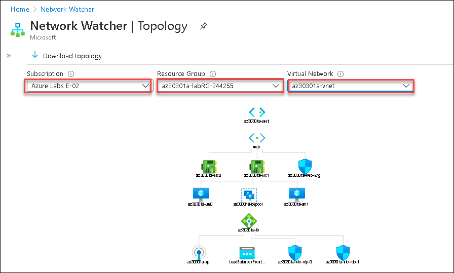

1. Review the resulting topology diagram, noting the connections between the public IP address, load balancer, and the network adapters of Azure VMs in its backend pool.

1. On the **Network Watcher** blade, select **Effective security rules**.

1. On the **Network Watcher \| Effective security rules** blade, specify the following settings:

    | Setting | Value | 
    | --- | --- |
    | Subscription | the name of the Azure subscription you are using in this lab |
    | Resource group | **az30301a-labRG-Deployment-id** |
    | Virtual machine | **az30301a-vm0** |
    | Network interface | **az30301a-nic0** |

   >**Note**: If you are not able to select the **Network interface**, click on **Virtual machine** field and select the **az30301a-vm0** again.
   
1. Review the associated network security group and the effective security rules, including two custom rules that allow inbound connectivity via RDP and HTTP. 

   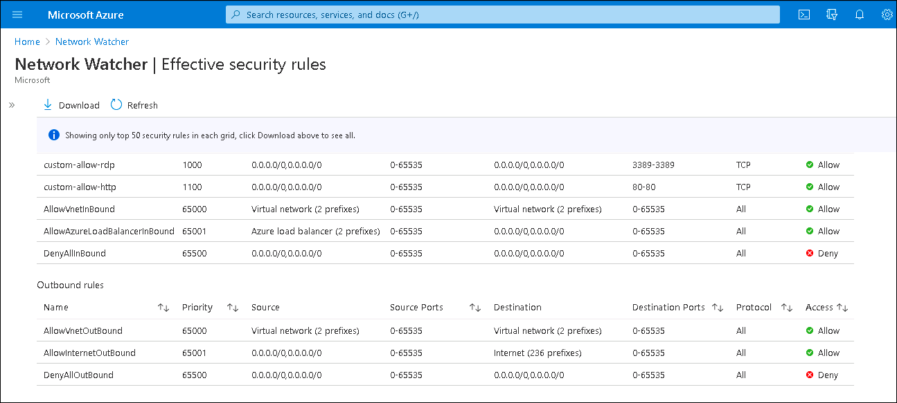

1. On the **Network Watcher** blade, select **Connection troubleshoot**.

    > **Note**: The intention is to verify the proximity (in the networking terms) of the two Azure VMs in the same availability set.

1. On the **Network Watcher \| Connection troubleshoot** blade, specify the following settings and select **Check** :

    | Setting | Value | 
    | --- | --- |
    | Subscription | the name of the Azure subscription you are using in this lab |
    | Resource group | **az30301a-labRG-Deployment-id** |
    | Source type | **Virtual machine** |
    | Virtual machine | **az30301a-vm0** |
    | Destination | **Select a virtual machine** |
    | Resource group | **az30301a-labRG-Deployment-id** |
    | Virtual machine | **az30301a-vm1** |
    | Protocol | **TCP** |
    | Destination port| **80** |
    
   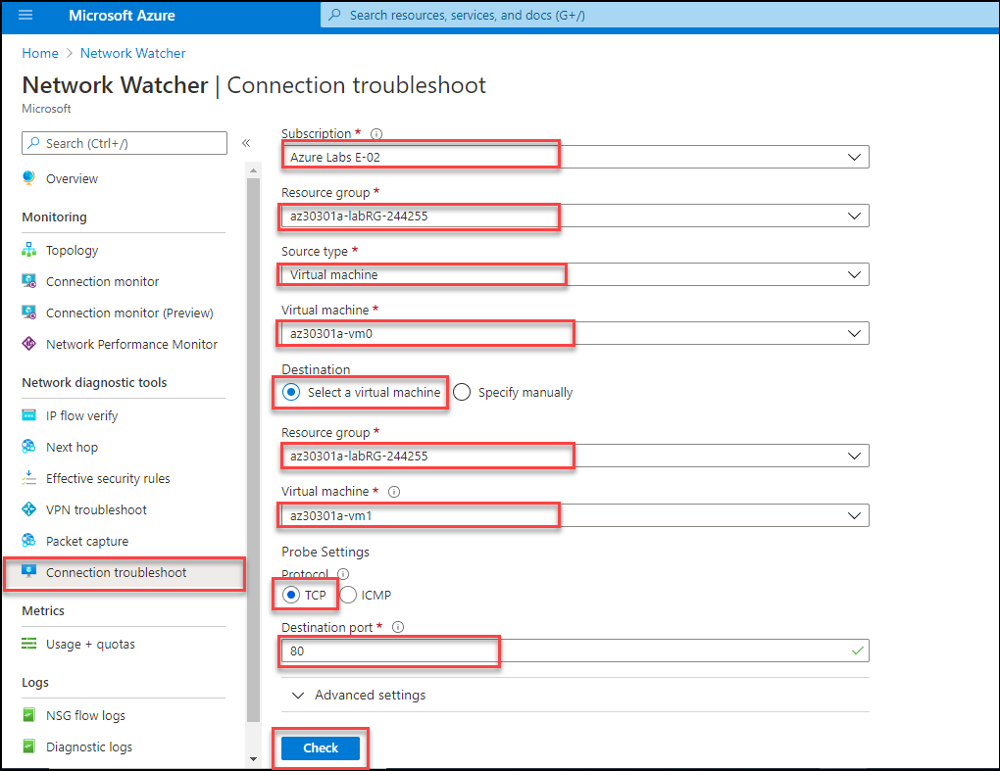
   
    > **Note**: You will need to wait a few minutes for the results in order for the **Azure Network Watcher Agent** VM extension to be installed on the Azure VMs.

1. Review the results and note the latency of the network connection between the Azure VMs.

   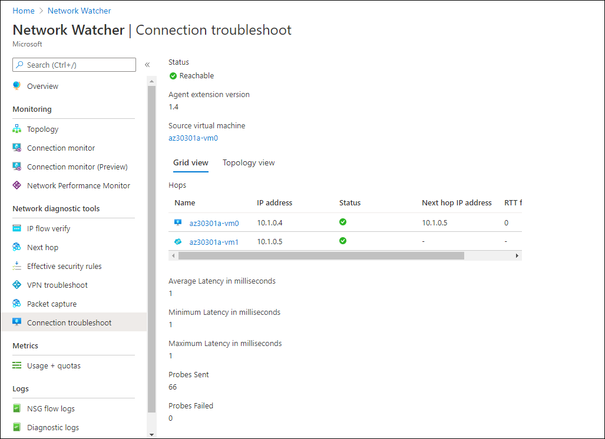

    > **Note**: The latency should be about 1 millisecond, since both VMs are in the same availability set (within the same Azure datacenter).

1. In the Azure portal, navigate to the **az30301a-labRG-Deployment-id** resource group blade, in the list of resources, select the **az30301a-avset** availability set entry, and on the **az30301a-avset** blade, note the fault domain and update domain values assigned Azure VMs.

1. In the Azure portal, navigate back to the **az30301a-labRG-Deployment-id** resource group blade, in the list of resources, select the **az30301a-lb** load balancer entry, and on the **az30301a-lb** blade, note the public IP address entry.

   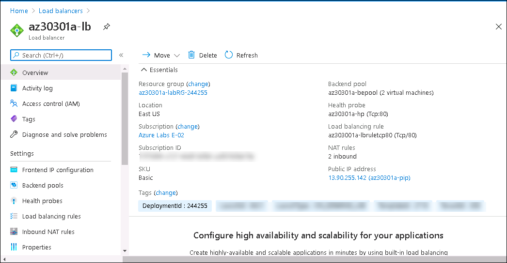

1. In the Azure portal, start a **Bash** session in the Cloud Shell pane. 

1. From the Cloud Shell pane, run the following to test load balancing of HTTP traffic to the Azure VMs in the backend pool of the Azure load balancer (replace the `<lb_IP_address>` placeholder with the IP address of the front end of the load balancer you identified earlier):

   ```sh
   for i in {1..4}; do curl <lb_IP_address>; done
   ```
   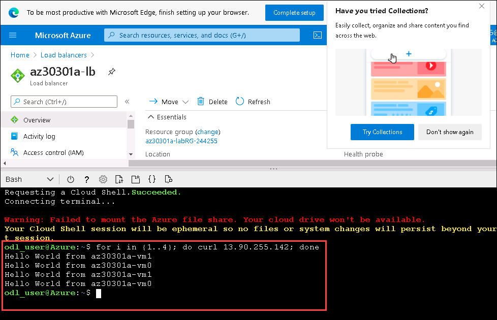
   
    > **Note**: Verify that the returned messages indicate that the requests are being delivered in the round robin manner to the backend Azure VMs

1. On the **az30301a-lb** blade, select the **Load balancing rules** entry and, on the **az30301a-lb \| Load balancing rules** blade, select the **az303001a-lbruletcp80** entry representing the load balancing rule handling HTTP traffic. 

1. On the **az303001a-lbruletcp80** blade, in the **Session persistence** drop-down list, select **Client IP** and then select **Save**.

   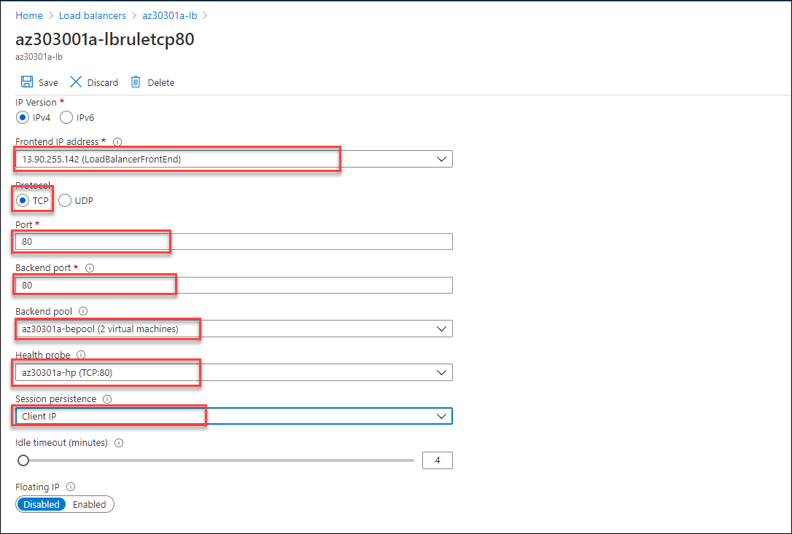

1. Wait for the update to complete and, from the Cloud Shell pane, re-run the following to test load balancing of HTTP traffic to the Azure VMs in the backend pool of the Azure load balancer without session persistence (replace the `<lb_IP_address>` placeholder with the IP address of the front end of the load balancer you identified earlier):

   ```sh
   for i in {1..4}; do curl <lb_IP_address>; done
   ```

    > **Note**: Verify that the returned messages indicate that the requests are being delivered to the same backend Azure VMs
    
   
   
1. In the Azure portal, navigate back to the **az30301a-lb** blade, select the **Inbound NAT rules** entry and note the two rules that allow for connecting to the first and the second of the backend pool VMs via Remote Desktop over TCP ports 33890 and 33891, respectively. 

   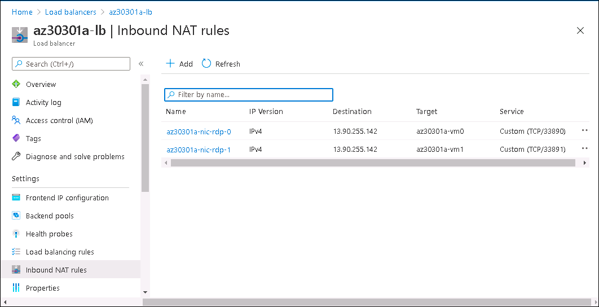

1. From the Cloud Shell pane, run the following to test Remote Desktop connectivity via NAT to the first Azure VM in the backend pool of the Azure load balancer (replace the `<lb_IP_address>` placeholder with the IP address of the front end of the load balancer you identified earlier):

   ```sh
   curl -v telnet://<lb_IP_address>:33890
   ```

    > **Note**: Verify that the returned message indicates that you are successfully connected. 

1. Press the **Ctrl+C** key combination to return to the Bash shell prompt and run the following to test Remote Desktop connectivity via NAT to the second Azure VM in the backend pool of the Azure load balancer (replace the `<lb_IP_address>` placeholder with the IP address of the front end of the load balancer you identified earlier):

   ```sh
   curl -v telnet://<lb_IP_address>:33891
   ```
   
   
    > **Note**: Verify that the returned message indicates that you are successfully connected. 

1. Press the **Ctrl+C** key combination to return to the Bash shell prompt.

#### Task 3: Remove Azure resources deployed in the exercise    

1. From the Cloud Shell pane, run the following to list the resource group you created in this exercise:

   ```sh
   az group list --query "[?starts_with(name,'az30301a-')]".name --output tsv
   ```

    > **Note**: Verify that the output contains only the resource group you created in this lab. This group will be deleted in this task.
1. From the Cloud Shell pane, run the following to delete the resource group you used in this lab

   ```sh
   az group list --query "[?starts_with(name,'az30301a-')]".name --output tsv | xargs -L1 bash -c 'az group delete --name $0 --no-wait --yes'
   ```

1. Close the Cloud Shell pane.

### Exercise 2: Implement and analyze highly available Azure VM deployments using availability zones and Azure Load Balancer Standard
  
The main tasks for this exercise are as follows:

1. Deploy highly available Azure VMs into availability zones behind an Azure Load Balancer Standard by using Azure Resource Manager templates

1. Analyze highly available Azure VMs deployed across availability zones behind an Azure Load Balancer Standard

1. Remove Azure resources deployed in the exercise


#### Task 1: Deploy highly available Azure VMs into availability zones behind an Azure Load Balancer Standard by using Azure Resource Manager templates

1. From the Cloud Shell pane, upload the Azure Resource Manager template **C:\AllFiles\AZ-303-Microsoft-Azure-Architect-Technologies-master\Allfiles\Labs\01\azuredeploy30301rgb.json**.

1. From the Cloud Shell pane, upload the Azure Resource Manager parameter file **C:\AllFiles\AZ-303-Microsoft-Azure-Architect-Technologies-master\Allfiles\Labs\01\azuredeploy30301rgb.parameters.json**.

1. From the Cloud Shell pane, run the following to deploy an Azure Load Balancer Standard with its backend pool consisting of a pair of Azure VMs hosting Windows Server 2019 Datacenter Core across two availability zones:

   ```sh
   az deployment group create \
   --resource-group az30301b-labRG-Deployment-id \
   --template-file azuredeploy30301rgb.json \
   --parameters @azuredeploy30301rgb.parameters.json
   ```

    > **Note**: Replace the Deployment-id with your deploymnet id given in environment detail page. Wait for the deployment to complete before proceeding to the next task. This should take about 10 minutes.

1. In the Azure portal, close the Cloud Shell pane. 


#### Task 2: Analyze highly available Azure VMs deployed across availability zones behind an Azure Load Balancer Standard

1. In the Azure portal, search for and select **Network Watcher** and, on the **Network Watcher** blade, select **Topology**.

1. On the **Network Watcher \| Topology** blade, specify the following settings:

    | Setting | Value | 
    | --- | --- |
    | Subscription | the name of the Azure subscription you are using in this lab |
    | Resource Group | **az30301b-labRG-Deployment-id** |
    | Virtual Network | **az30301b-vnet** |
    
       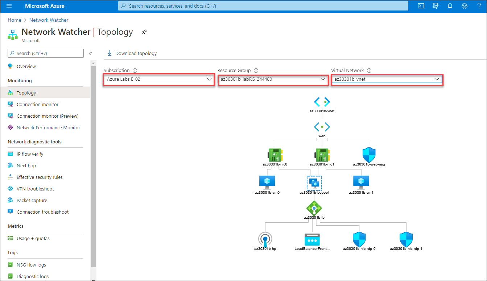

1. Review the resulting topology diagram, noting the connections between the public IP address, load balancer, and the network adapters of Azure VMs in its backend pool.

    > **Note**: This diagram is practically identical to the one you viewed in the previous exercise, since, despite being in different zones (and effectively Azure data centers), the Azure VMs reside on the same subnet.

1. On the **Network Watcher** blade, select **Effective security rules**.

1. On the **Network Watcher \| Effective security rules** blade, specify the following settings:

    | Setting | Value | 
    | --- | --- |
    | Subscription | the name of the Azure subscription you are using in this lab |
    | Resource group | **az30301b-labRG-Deployment-id** |
    | Virtual machine | **az30301b-vm0** |
    | Network interface | **az30301b-nic0** |
    
    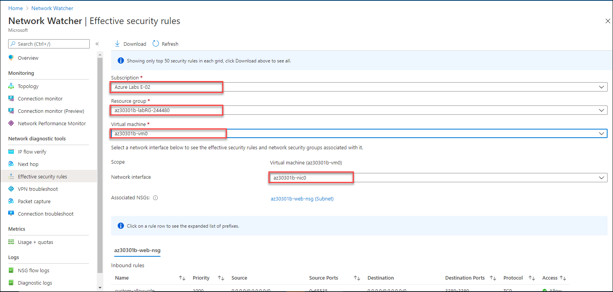
    
   >**Note**: If you are not able to select the **Network interface**, click on **Virtual machine** field and select the **az30301b-vm0** again.
   
1. Review the associated network security group and the effective security rules, including two custom rules that allow inbound connectivity via RDP and HTTP. 

    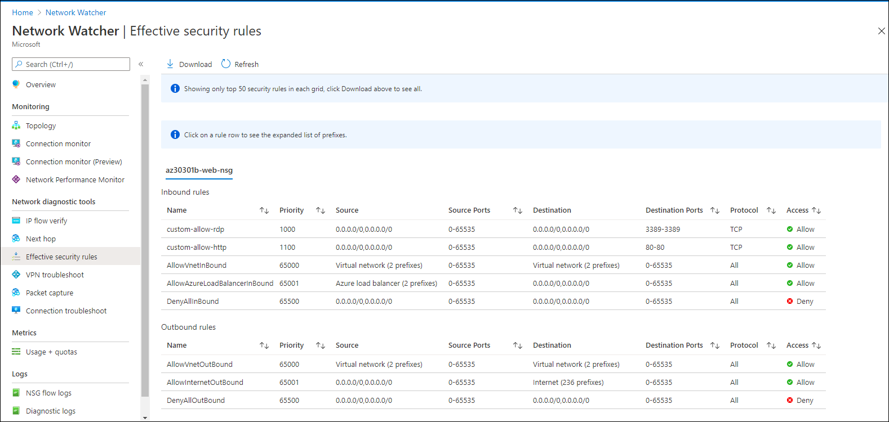

    > **Note**: This listing is also practically identical to the one you viewed in the previous exercise, with network-level protection implemented by using a network security group associated with the subnet to which both Azure VMs are connected. Keep in mind, however, that the network security group is, in this case, required for the HTTP and RDP traffic to reach the backend pool Azure VMs, due to the usage of the Azure Load Balancer Standard SKU (NSGs are optional when using the Basic SKU).

1. On the **Network Watcher** blade, select **Connection troubleshoot**.

    > **Note**: The intention is to verify the proximity (in the networking terms) of the two Azure VMs in the same availability set.

1. On the **Network Watcher \| Connection troubleshoot** blade, specify the following settings and select **Check** :

    | Setting | Value | 
    | --- | --- |
    | Subscription | the name of the Azure subscription you are using in this lab |
    | Resource group | **az30301b-labRG-Deployment-id** |
    | Source type | **Virtual machine** |
    | Virtual machine | **az30301b-vm0** |
    | Destination | **Select a virtual machine** |
    | Resource group | **az30301b-labRG** |
    | Virtual machine | **az30301b-vm1** |
    | Protocol | **TCP** |
    | Destination port| **80** |

    > **Note**: You will need to wait a few minutes for the results in order for the **Azure Network Watcher Agent** VM extension to be installed on the Azure VMs.

1. Review the results and note the latency of the network connection between the Azure VMs.

  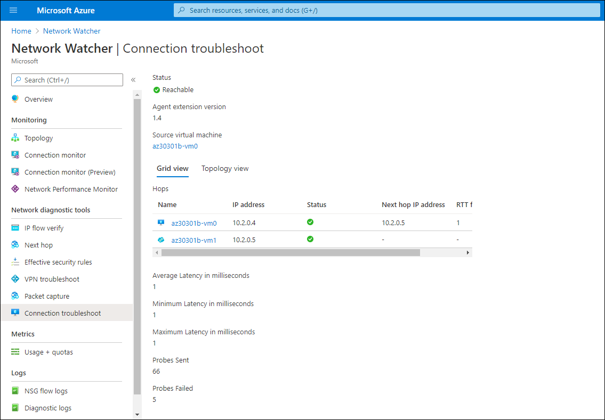
       
    > **Note**: The latency might be slightly higher than the one you observed in the previous exercise, since the two VMs are in different zones (within different Azure datacenters).

1. In the Azure portal, navigate to the **az30301b-labRG-Deployment-id** resource group blade, in the list of resources, select the **az30301b-vm0** virtual machine entry, and on the **az30301b-vm0** blade, note the **Location** and **Availability zone** entries. 

1. In the Azure portal, navigate to the **az30301b-labRG-Deployment-id** resource group blade, in the list of resources, select the **az30301b-vm1** virtual machine entry, and on the **az30301b-vm1** blade, note the **Location** and **Availability zone** entries. 

    > **Note**: The entries you reviewed confirm that each Azure VM resides in a different availability zone.

1. In the Azure portal, navigate to the **az30301b-labRG-Deployment-id** resource group blade and, in the list of resources, select the **az30301b-lb** load balancer entry, and on the **az30301b-lb** blade, note the public IP address entry.

1. In the Azure portal, start a new **Bash** session in the Cloud Shell pane. 

1. From the Cloud Shell pane, run the following to test load balancing of HTTP traffic to the Azure VMs in the backend pool of the Azure load balancer (replace the `<lb_IP_address>` placeholder with the IP address of the front end of the load balancer you identified earlier):

   ```sh
   for i in {1..4}; do curl <lb_IP_address>; done
   ```

    > **Note**: Verify that the returned messages indicate that the requests are being delivered in the round robin manner to the backend Azure VMs

1. On the **az30301b-lb** blade, select the **Load balancing rules** entry and, on the **az30301b-lb \| Load balancing rules** blade, select the **az303001b-lbruletcp80** entry representing the load balancing rule handling HTTP traffic. 

1. On the **az303001b-lbruletcp80** blade, in the **Session persistence** drop-down list, select **Client IP** and then select **Save**.

   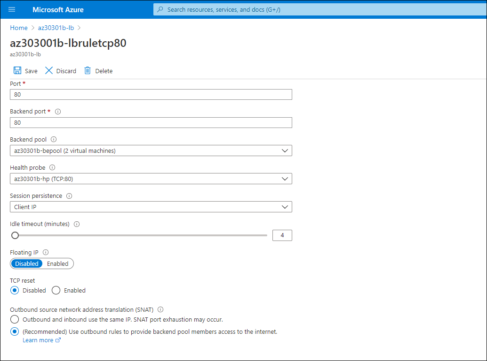

1. Wait for the update to complete and, from the Cloud Shell pane, re-run the following to test load balancing of HTTP traffic to the Azure VMs in the backend pool of the Azure load balancer without session persistence (replace the `<lb_IP_address>` placeholder with the IP address of the front end of the load balancer you identified earlier):

   ```sh
   for i in {1..4}; do curl <lb_IP_address>; done
   ```
   
   
    > **Note**: Verify that the returned messages indicate that the requests are being delivered to the same backend Azure VMs

1. In the Azure portal, navigate back to the **az30301b-lb** blade, select the **Inbound NAT rules** entry and note the two rules that allow for connecting to the first and the second of the backend pool VMs via Remote Desktop over TCP ports 33890 and 33891, respectively. 

   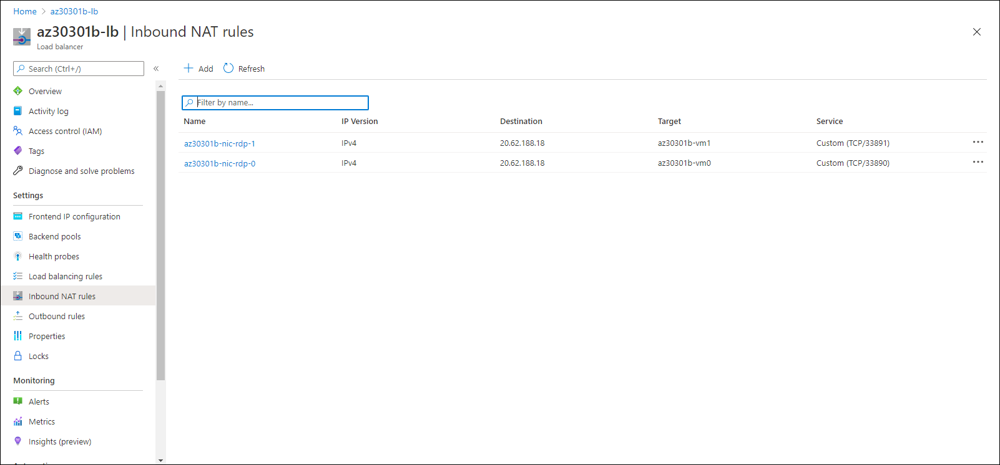
   
1. From the Cloud Shell pane, run the following to test Remote Desktop connectivity via NAT to the first Azure VM in the backend pool of the Azure load balancer (replace the `<lb_IP_address>` placeholder with the IP address of the front end of the load balancer you identified earlier):

   ```sh
   curl -v telnet://<lb_IP_address>:33890
   ```

    > **Note**: Verify that the returned message indicates that you are successfully connected. 

1. Press the **Ctrl+C** key combination to return to the Bash shell prompt and run the following to test Remote Desktop connectivity via NAT to the second Azure VM in the backend pool of the Azure load balancer (replace the `<lb_IP_address>` placeholder with the IP address of the front end of the load balancer you identified earlier):

   ```sh
   curl -v telnet://<lb_IP_address>:33891
   ```
  
  

    > **Note**: Verify that the returned message indicates that you are successfully connected. 

1. Press the **Ctrl+C** key combination to return to the Bash shell prompt and close the Cloud Shell pane.

1. On the **az30301b-lb** blade, select the **Load balancing rules** entry and, on the **az30301b-lb \| Load balancing rules** blade, select the **az303001b-lbruletcp80** entry representing the load balancing rule handling HTTP traffic. 

1. On the **az303001b-lbruletcp80** blade, in the **Outbound source network address translation (SNAT)** section, select **(Recommended) Use outbound rules to provide backend pool members access to the internet.**, and then select **Save**.

1. Navigate back to the **az30301b-lb** blade, select the **Outbound rules** entry, and on the **az30301b-lb \| Outbound rules** blade, select **+ Add**.

1. On the **Add outbound rule** blade, specify the following settings and select **Add** (leave all other settings with their default values):

    | Setting | Value | 
    | --- | --- |
    | Name | **az303001b-obrule** | 
    | Frontend IP address | the name of the existing frontend IP address of the **az30301b-lb** load balancer |
    | Backend pool | **az30301b-bepool** |
    | Port allocation | **Manually choose number of outbound ports** |
    | Choose by | **Maximum number of backend instances** |
    | Maximum number of backend instances | **3** |

   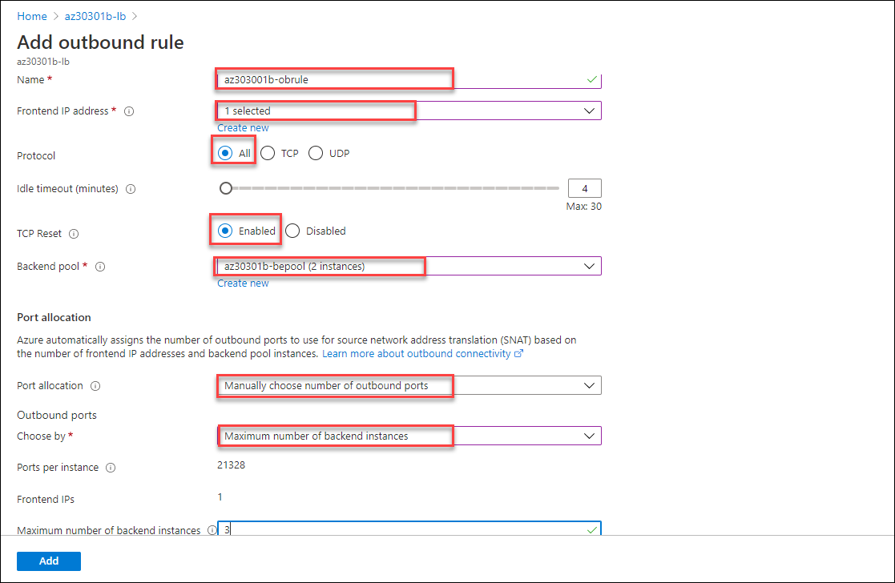

    > **Note**: Azure Load Balancer Standard allows you to designate a dedicated frontend IP address for outbound traffic (in cases where multiple frontend IP addresses are assigned).

1. In the Azure portal, navigate to the **az30301b-labRG-Deployment-id** resource group blade, in the list of resources, select the **az30301b-vm0** virtual machine entry, and on the **az30301b-vm0** blade, in the **Operations** blade, select **Run command**.

   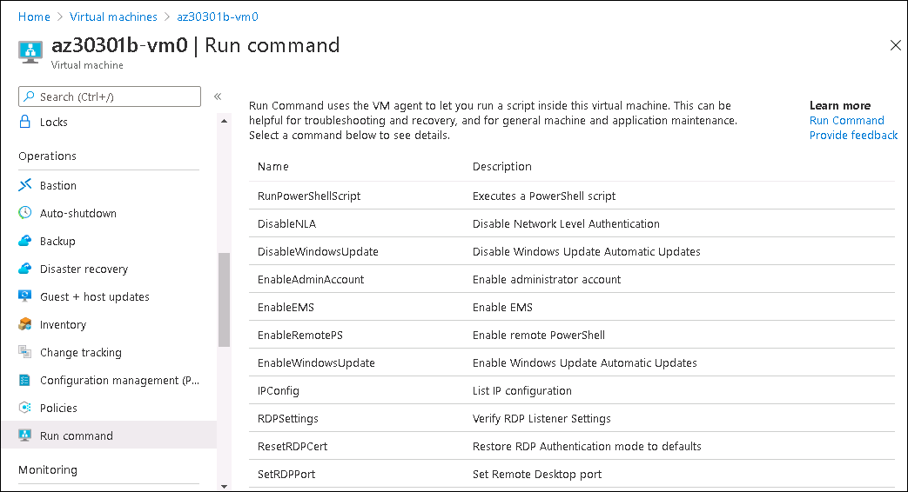

1. On the **az30301b-vm0 \| Run command** blade, select **RunPowerShellScript**. 

1. On the **Run Command Script** blade, in the **PowerShell Script** text box, type the following and select **Run**.

   ```powershell
   (Invoke-RestMethod -Uri "http://ipinfo.io").IP
   ```
   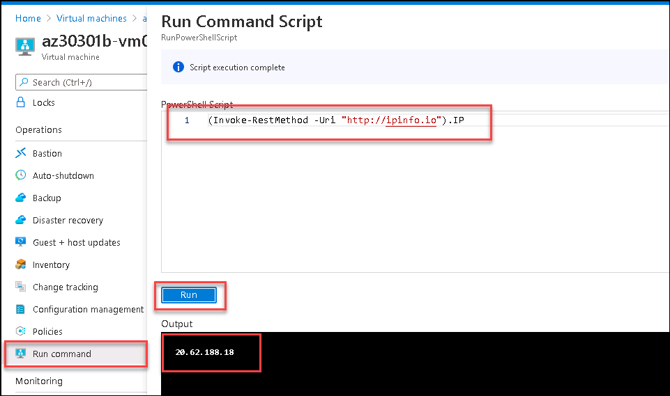
   
    > **Note**: This command returns the public IP address from which the web request originates.

1. Review the output and verify that it matches the public IP address assigned to the frontend of the Azure Load Balancer Standard, which you assigned to the outbound load balancing rule.


#### Task 3: Remove Azure resources deployed in the exercise

1. In the Azure portal, start a new **Bash** session in the Cloud Shell pane. 

1. From the Cloud Shell pane, run the following to list the resource group you created in this exercise:

   ```sh
   az group list --query "[?starts_with(name,'az30301b-')]".name --output tsv
   ```

    > **Note**: Verify that the output contains only the resource group you created in this lab. This group will be deleted in this task.

1. From the Cloud Shell pane, run the following to delete the resource group you used in this lab

   ```sh
   az group list --query "[?starts_with(name,'az30301b-')]".name --output tsv | xargs -L1 bash -c 'az group delete --name $0 --no-wait --yes'
   ```

1. Close the Cloud Shell pane.


### Exercise 3: Implement and analyze highly available Azure VM Scale Set deployments using availability zones and Azure Application Gateway.
  
The main tasks for this exercise are as follows:

1. Deploy a highly available Azure VM Scale Set into availability zones behind an Azure Application Gateway by using Azure Resource Manager templates

1. Analyze a highly available Azure VM Scale Set deployed across availability zones behind an Azure Application Gateway

1. Remove Azure resources deployed in the exercise


#### Task 1: Deploy a highly available Azure VM Scale Set into availability zones behind an Azure Application Gateway by using Azure Resource Manager templates

1. From the Cloud Shell pane, upload the Azure Resource Manager template **C:\AllFiles\AZ-303-Microsoft-Azure-Architect-Technologies-master\Allfiles\Labs\01\azuredeploy30301rgc.json**.

1. From the Cloud Shell pane, upload the Azure Resource Manager parameter file **C:\AllFiles\AZ-303-Microsoft-Azure-Architect-Technologies-master\Allfiles\Labs\01\azuredeploy30301rgc.parameters.json**.

1. From the Cloud Shell pane, run the following to deploy an Azure Application Gateway with its backend pool consisting of a pair of Azure VMs hosting Windows Server 2019 Datacenter Core across different availability zones:

   ```
   az deployment group create --resource-group az30301c-labRG-Deployment-id --template-file azuredeploy30301rgc.json --parameters @azuredeploy30301rgc.parameters.json
   ```

    > **Note**: Replace the Deployment-id with your deploymnet id given in environment detail page. Wait for the deployment to complete before proceeding to the next task. This should take about 10 minutes.

1. In the Azure portal, close the Cloud Shell pane. 


#### Task 2: Analyze a highly available Azure VM Scale Set deployed across availability zones behind an Azure Application Gateway

1. In the Azure portal, search for and select **Network Watcher** and, on the **Network Watcher** blade, select **Topology**.

1. On the **Network Watcher \| Topology** blade, specify the following settings:

    | Setting | Value | 
    | --- | --- |
    | Subscription | the name of the Azure subscription you are using in this lab |
    | Resource Group | **az30301c-labRG-Deployment-id** |
    | Virtual Network | **az30301c-vnet** |
    
   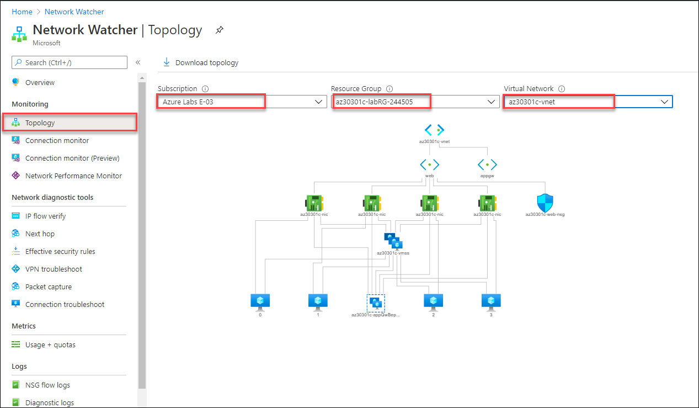

1. Review the resulting topology diagram, noting the connections between the public IP address, load balancer, and the network adapters of Azure VM instances in the Azure Virtual Machine Scale Set in its backend pool. 

    > **Note**: In addition, deployment of an Azure Application Gateway requires a dedicated subnet, included in the diagram (although the gateway is not displayed).

    > **Note**: In this configuration, it is not possible to use Network Watcher to view the effective network security rules (that is one of distinctions between Azure VMs and instances of an Azure VM Scale Set). Similarly, you cannot rely on use **Connection troubleshoot** to test network connectivity from Azure VM Scale Set instances, although it is possible to use it to test connectivity from the Azure Application Gateway.

1. In the Azure portal, navigate to the **az30301c-labRG-Deployment-id** resource group blade, in the list of resources, and select the **az30301c-vmss** virtual machine scale set entry. 

   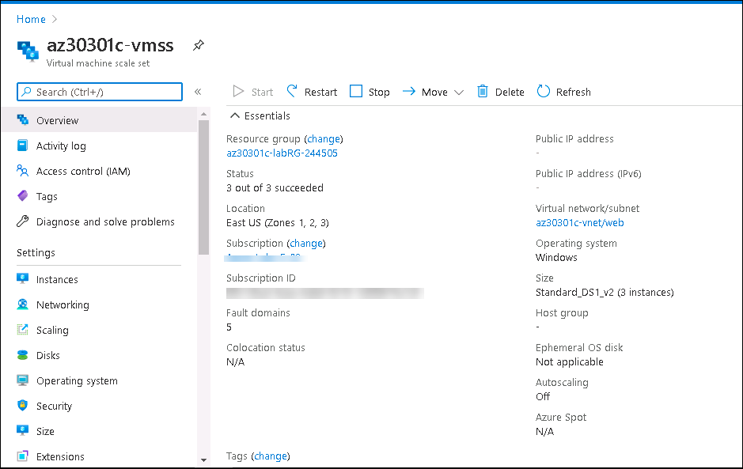

1. On the **az30301c-vmss** blade, note the **Location** and **Fault domains** entries. 

   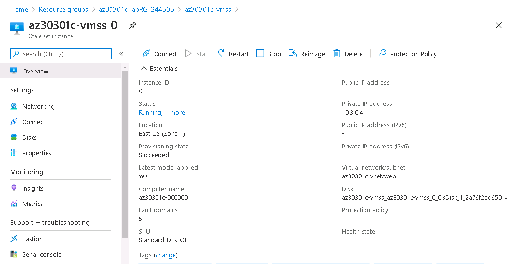

    > **Note**: Unlike Azure VMs, individual instances of Azure VM scale sets deploy into separate fault domains, including instances deployed into the same zone. In addition, they support 5 fault domains (unlike Azure VMs, which can use up to 3 fault domains). 

1. On the **az30301c-vmss** blade, select **Instances**, on the **az30301c-vmss \| Instances** blade, select the first instance, and identify its availability zone by reviewing the value of the **Location** property. 

1. Navigate back to the **az30301c-vmss \| Instances** blade, select the second instance, and identify its availability zone by reviewing the value of the **Location** property. 

    > **Note**: Verify that each instance resides in a different availability zone.

1. In the Azure portal, navigate to the **az30301c-labRG-Deployment-id** resource group blade and, in the list of resources, select the **az30301c-appgw** load balancer entry, and on the **az30301c-appgw** blade, note the public IP address entry.

   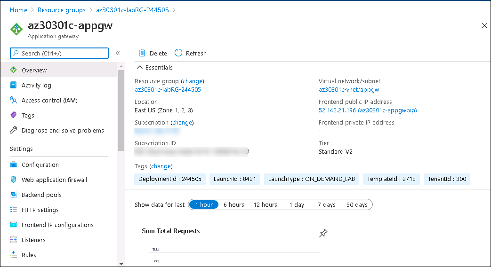

1. In the Azure portal, start a new **Bash** session in the Cloud Shell pane. 

1. From the Cloud Shell pane, run the following to test load balancing of HTTP traffic to the Azure VM Scale Set instances in the backend pool of the Azure Application Gateway (replace the `<lb_IP_address>` placeholder with the IP address of the front end of the gateway you identified earlier):

   ```sh
   for i in {1..4}; do curl <lb_IP_address>; done
   ```

    > **Note**: Verify that the returned messages indicate that the requests are being delivered in the round robin manner to the backend Azure VMs

1. On the **az30301c-appgw** blade, select the **HTTP settings** entry and, on the **az30301c-appgw \| HTTP settings** blade, select the **appGwBackentHttpSettings** entry representing the load balancing rule handling HTTP traffic.

   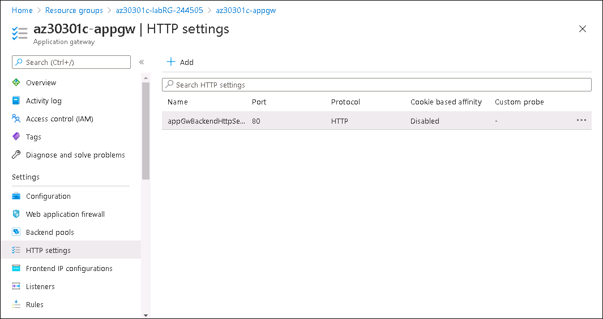

1. On the **appGwBackentHttpSettings** blade, review the existing settings without making any changes and note that you can enable **Cookie-based affinity**.

   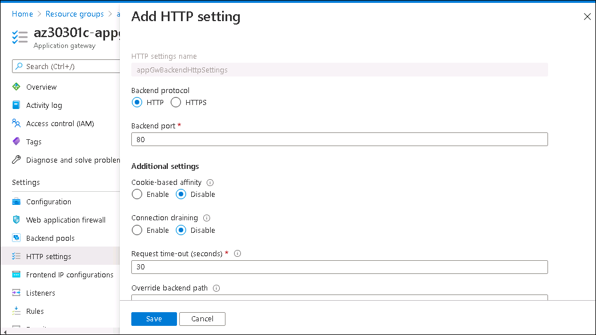

    > **Note**: This feature requires that the client supports the use of cookies.

    > **Note**: You cannot use Azure Application Gateway to implement NAT for RDP connectivity to instances of an Azure VM Scale Set. Azure Application Gateway supports only HTTP/HTTPS traffic.


### Exercise 4: Implementing autoscaling of Azure VM Scale Sets using availability zones and Azure Application Gateway.
  
The main tasks for this exercise are as follows:

1. Configuring autoscaling of an Azure VM Scale Set

1. Testing autoscaling of an Azure VM Scale Set

#### Task 1: Configure autoscaling of an Azure VM Scale Set

1. In the Azure portal, navigate to the **az30301c-labRG-Deployment-id** resource group blade, in the list of resources, select the **az30301c-vmss** virtual machine scale set entry, and on the **az30301c-vmss** blade, select **Scaling**. 

1. On the **az30301c-vmss \| Scaling** blade, select the **Custom autoscale** option.

   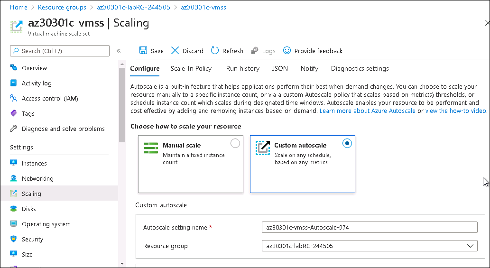

1. In the **Custom autoscale** section, specify the following settings (leave others with their default values):

    | Setting | Value | 
    | --- | --- |
    | Scaling mode | **Scale based on a metric** |
    | Instance limits Minimum | **1** |
    | Instance limits Maximum | **3** |
    | Instance limits Default | **1** |

   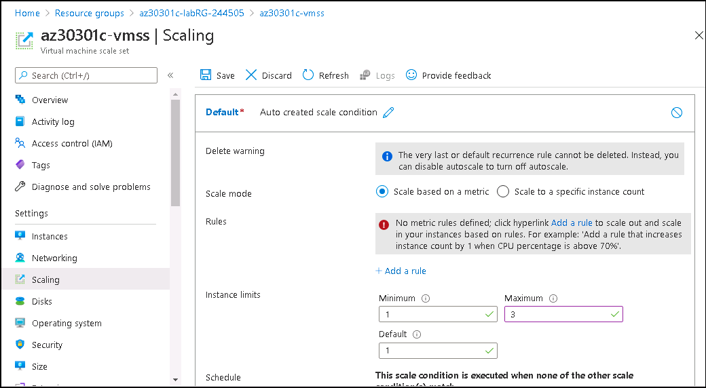

1. Select **+ Add a rule**.

1. On the **Scale rule** blade, specify the following settings and select **Add** (leave others with their default values):

    | Setting | Value | 
    | --- | --- |
    | Time aggregation | **Maximum** |
    | Metric namespace | **Virtual Machine Host** |
    | Metric name | **Percentage CPU** |
    | VMName Operator | **=** |
    | Dimension values | **2 selected** |
    | Enable metric divide by instance count | **Enabled** |
    | Operator | **Greater than** |
    | Metric threshold to trigger scale action | **1** |
    | Duration (in minutes) | **1** |
    | Time grain statistics | **Maximum** |
    | Operation | **Increase count by** |
    | Instance count | **1** |
    | Cool down (minutes) | **5** |

   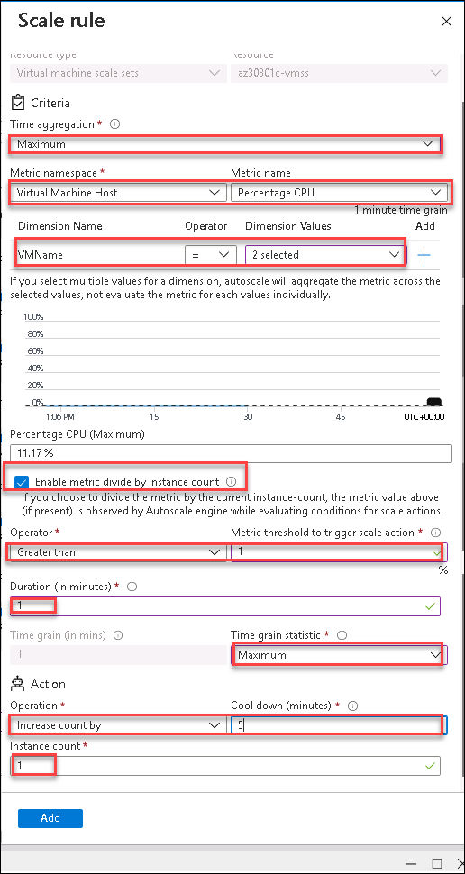

    > **Note**: These values are selected strictly for lab purposes to trigger scaling as soon as possible. For guidance regarding Azure VM Scale Set scaling, refer to [Microsoft Docs](https://docs.microsoft.com/en-us/azure/virtual-machine-scale-sets/virtual-machine-scale-sets-autoscale-overview) . 

1. Back on the **az30301c-vmss \| Scaling** blade, select **+ Add a rule**.

1. On the **Scale rule** blade, specify the following settings and select **Add** (leave others with their default values):

    | Setting | Value | 
    | --- | --- |
    | Time aggregation | **Average** |
    | Metric namespace | **Virtual Machine Host** |
    | Metric name | **Percentage CPU** |
    | VMName Operator | **=** |
    | Dimension values | **2 selected** |
    | Enable metric divide by instance count | **Enabled** |
    | Operator | **Less than** |
    | Metric threshold to trigger scale action | **1** |
    | Duration (in minutes) | **1** |
    | Time grain statistics | **Minimum** |
    | Operation | **Decrease count by** |
    | Instance count | **1** |
    | Cool down (minutes) | **5** |

   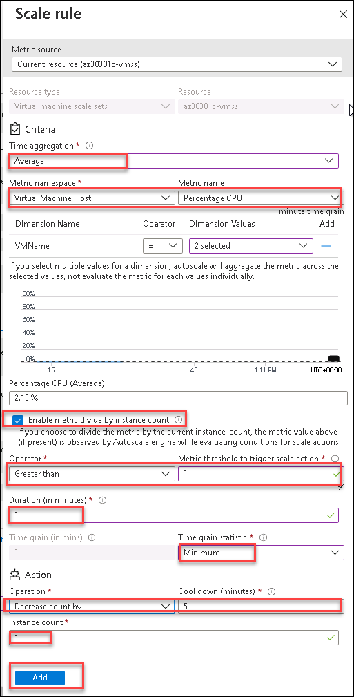

1. Back on the **az30301c-vmss | Scaling** blade, select **Save**.


#### Task 2: Test autoscaling of an Azure VM Scale Set

1. In the Azure portal, start a new **Bash** session in the Cloud Shell pane. 

1. From the Cloud Shell pane, run the following to trigger autoscaling of the Azure VM Scale Set instances in the backend pool of the Azure Application Gateway (replace the `<lb_IP_address>` placeholder with the IP address of the front end of the gateway you identified earlier):

   ```sh
   for (( ; ; )); do curl -s <lb_IP_address>?[1-10]; done
   ```
1. In the Azure portal, on the **az30301c-vmss** blade, review the **CPU (average)** chart and verify that the CPU utilization of the Application Gateway increased sufficiently to trigger scaling out.

    > **Note**: You might need to wait a few minutes.

1. On the **az30301c-vmss** blade, select the **Instances** entry and verify that the number of instances has increased.

    > **Note**: You might need to refresh the **az30301c-vmss \| Instances** blade.

    > **Note**: You might see the number of instances increasing by 2 (rather than 1).

1. In the Azure portal, close the **Cloud Shell** pane. 

1. In the Azure portal, on the **az30301c-vmss** blade, review the **CPU (average)** chart and verify that the CPU utilization of the Application Gateway decreased sufficiently to trigger scaling in. 

    > **Note**: You might need to wait a few minutes.

1. On the **az30301c-vmss** blade, select the **Instances** entry and verify that the number of instances has decreased to 2.

    > **Note**: You might need to refresh the **az30301c-vmss \| Instances** blade.

1. On the **az30301c-vmss** blade, select **Scaling**. 

1. On the **az30301c-vmss \| Scaling** blade, select the **Manual scale** option and select **Save**.

    > **Note**: This will prevent any undesired autoscaling during the next exercise. 


### Exercise 5: Implementing vertical scaling of Azure VM Scale Sets

The main tasks for this exercise are as follows:

1. Scaling compute resources of Azure virtual machine scale set instances.

1. Scaling storage resources of Azure virtual machine scale sets instances.


#### Task 1: Scale compute resources of Azure virtual machine scale set instances.

1. In the Azure Portal, on the **az30301c-vmss** blade, select **Size**.

1. In the list of available sizes, select any available size other than currently configured and select **Resize**.

   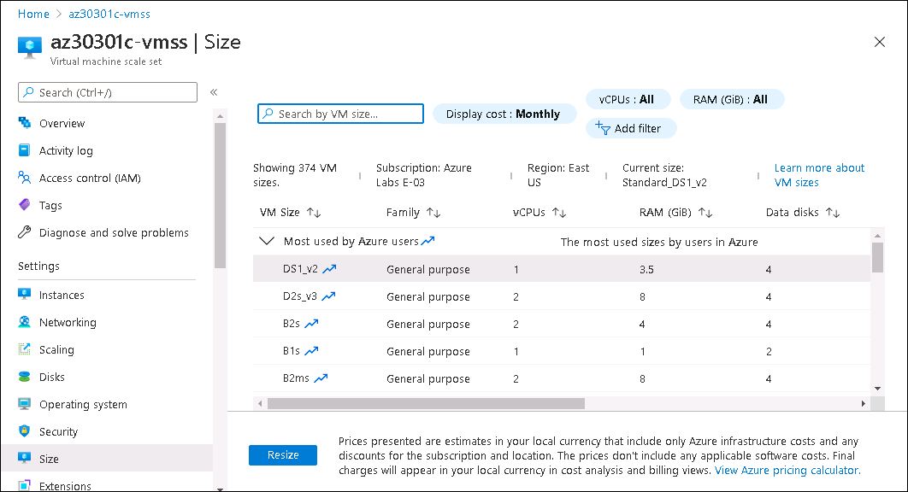

1. On the **az30301c-vmss** blade, select the **Instances** entry and, on the **az30301c-vmss \| Instances** blade, observe the process of replacing existing instances with new ones of the desired size.

    > **Note**: You might need to refresh the **az30301c-vmss \| Instances** blade.

1. Wait until the instances are updated and running.


#### Task 2: Scale storage resources of Azure virtual machine scale sets instances.

1. On the **az30301c-vmss** blade, select **Disks**, select **+ Add data disk**, attach a new managed disk with the following settings (leave others with their default values), and select **Save**:

    | Setting | Value | 
    | --- | --- |
    | LUN | **0** |
    | Size | **32** |
    | Storage account type | **Standard HDD** |
    
   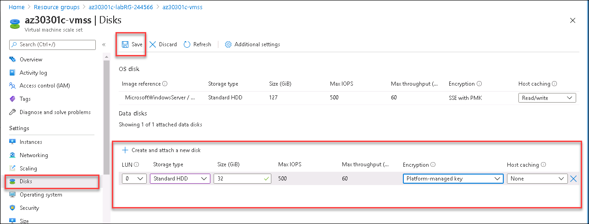

1. On the **az30301c-vmss** blade, select the **Instances** entry and, on the **az30301c-vmss \| Instances** blade, observe the process of updating the existing instances.

    > **Note**: The disk attached in the previous step is a raw disks. Before it can be used, it is necessary to create a partition, format it, and mount it. To accomplish this, you will deploy a PowerShell script to Azure VM scale set instances via the Custom Script extension. First, however, you will need to remove it.

1. On the **az30301c-vmss** blade, select **Extensions**, on the **az30301c-vmss \| Extensions** blade, select the **customScriptExtension** entry, and then, on the **Extensions** blade, select **Uninstall**.

   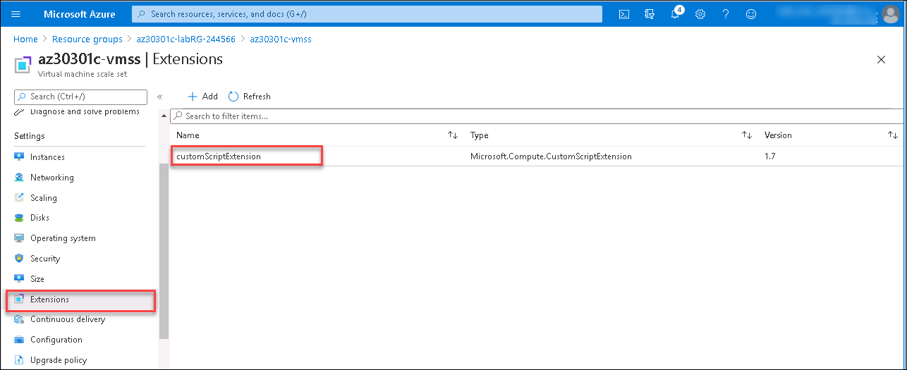

    > **Note**: Wait for uninstallation to complete.

1. In the Azure portal, navigate to the **az30301c-labRG-Deployment-id** resource group blade, in the list of resources, select the storage account resource. 

1. On the storage account blade, select **Containers** and then select **+ Container**. 

   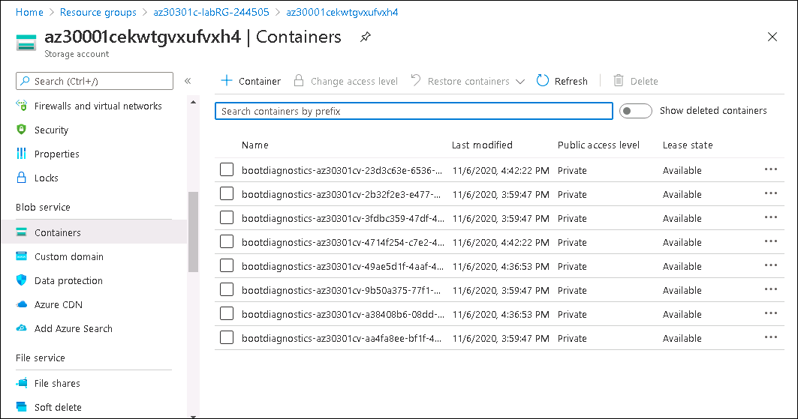

1. On the **New container** blade, specify the following settings (leave others with their default values) and select **Create**:

    | Setting | Value | 
    | --- | --- |
    | Name | **scripts** |
    | Public access level | **Private (no anonymous access**) |
    
   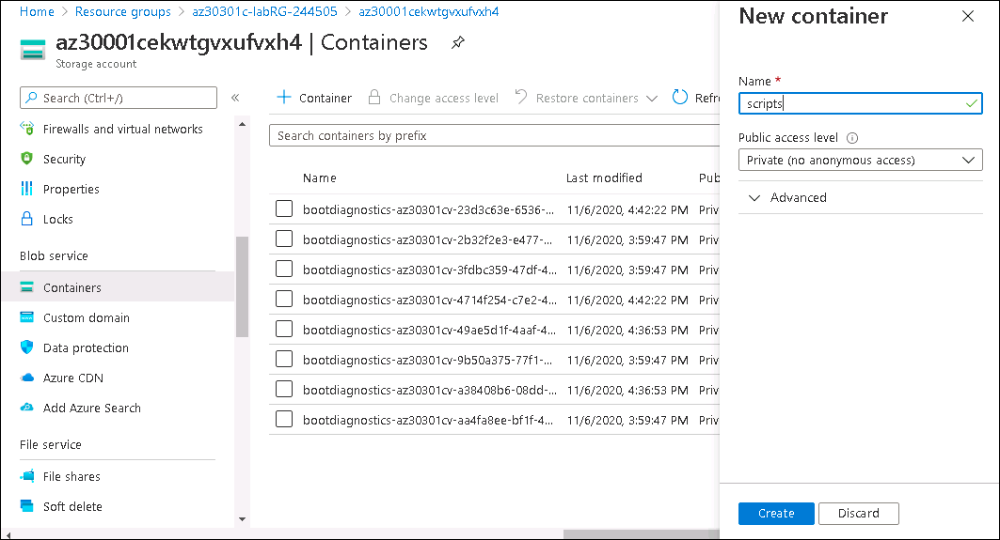
    
1. Back on the storage account blade displaying the list of containers, select **scripts**.

1. On the **scripts** blade, select **Upload**.

1. On the **Upload blob** blade, select the folder icon, in the **Open** dialog box, navigate to the **C:\AllFiles\AZ-303-Microsoft-Azure-Architect-Technologies-master\Allfiles\Labs\01** folder, select **az30301e-configure_VMSS_with_data_disk.ps1**, select **Open**, and back on the **Upload blob** blade, select **Upload**. 

1. In the Azure portal, navigate back to the **az30301c-vmss** virtual machine scale set blade. 

1. On the **az30301c-vmss** blade, select **Extensions**, on the **az30301c-vmss \| Extensions** blade, select **+ Add** and then, select the **customScriptExtension** entry on the **Extensions** blade.

   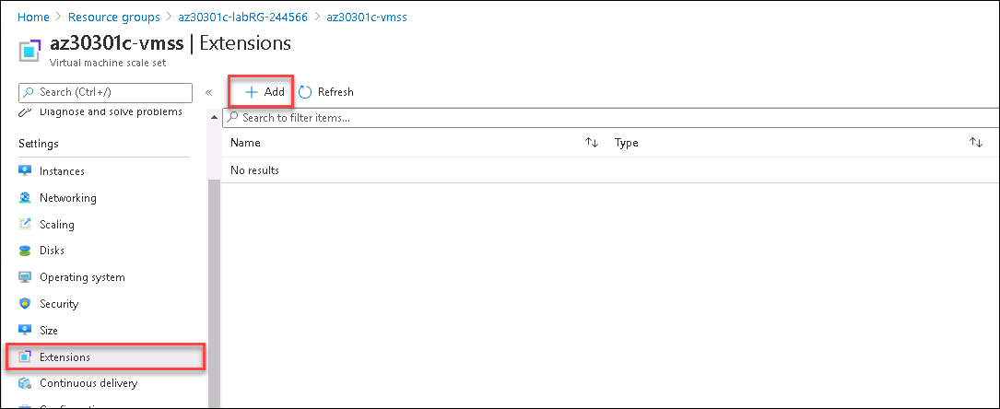
   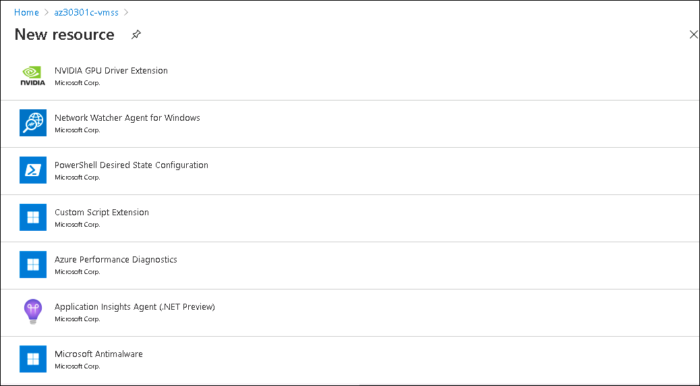

1. On the **New resource** blade, select **Custom Script Extension** and then select **Create**.

   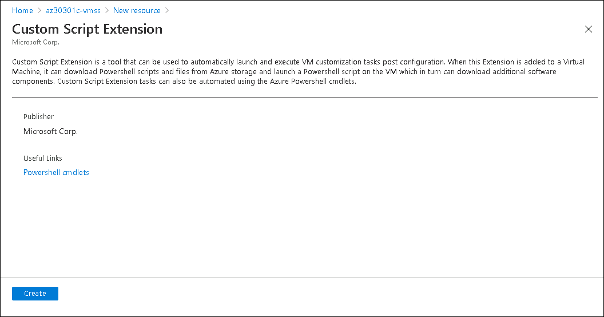

1. From the **Install extension** blade, select **Browse**. 

   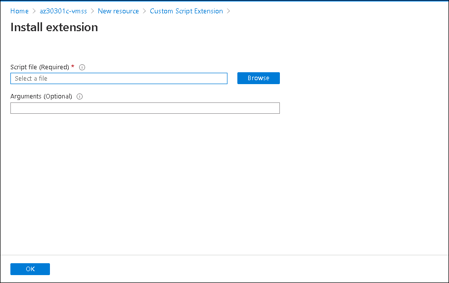

1. On the **Storage accounts** blade, select the name of the storage account into which you uploaded the **az30301e-configure_VMSS_with_data_disk.ps1** script, on the **Containers** blade, select **scripts**, on the **scripts** blade, select **az30301e-configure_VMSS_with_data_disk.ps1**, and then select **Select**. 

   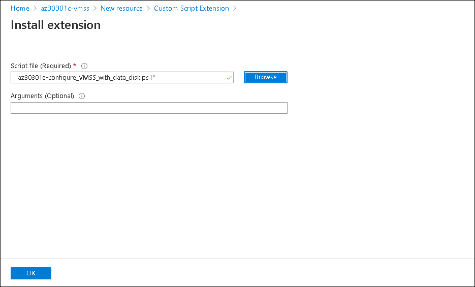

1. Back on the **Install extension** blade, select **OK**.

1. On the **az30301c-vmss** blade, select the **Instances** entry and, on the **az30301c-vmss | Instances** blade, observe the process of updating existing instances.

    > **Note**: You might need to refresh the **az30301c-vmss \| Instances** blade.

